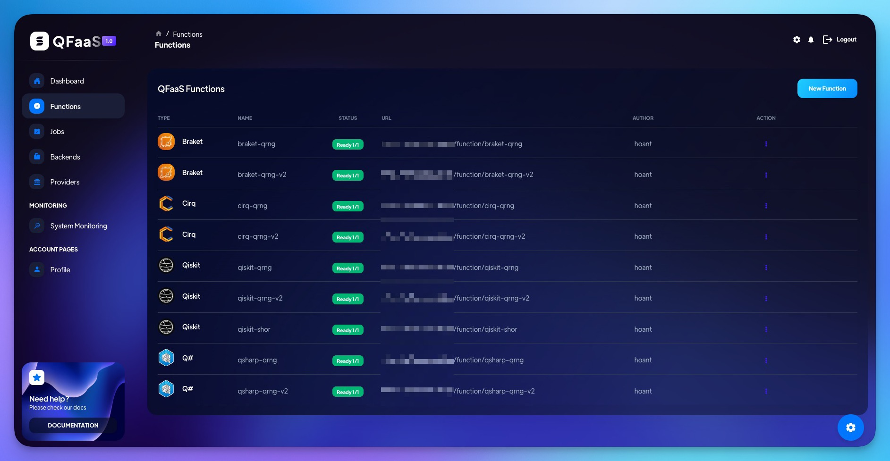

# QFaaS: A Quantum Function-as-a-Service Framework  

QFaaS is a Quantum Function-as-a-Service framework that leverages the advantages of the serverless computing model and state-of-the-art software engineering techniques to advance practical quantum computing in the Noisy Intermediate-Scale Quantum (NISQ) era. Our framework provides essential elements of a serverless quantum system to streamline service-oriented quantum application development in cloud environments, such as combining hybrid quantum-classical computation, automating the backend selection, and adapting Quantum DevOps workflow. QFaaS offers the first full-stack and unified quantum serverless platform by integrating multiple well-known quantum software development kits, quantum simulators, and quantum cloud providers (IBM Quantum and Amazon Braket).

### Highlights
- Support developing quantum functions using 4 popular quantum SDKs, including Qiskit, Q#, Cirq, and Braket.
- Built-in APIs with API gateway to manage system components, quantum functions, jobs, quantum backend and providers.
- Simplify quantum programming and enable hybrid quantum-classical function development with a built-in Python library.
- Execute quantum functions on both internal quantum simulators and external quantum computers/simulators from IBM Quantum and Strangeworks Quantum Computing platforms (Amazon Braket).




### QFaaS Architecture 
The architecture design of QFaaS comprises six main components: the QFaaS APIs and API Gateway, the Application Deployment Layer, the Classical Cloud Layer, the Quantum Cloud Layer, the Monitoring Layer, and the User Interface. 


## Deployment Guideline
For detailed instructions on deploying the QFaaS framework, please refer to our documentation [here](https://arxiv.org/abs/2407.02828). If you experience any issues during deployment, please create a new issue, and we will be happy to assist. For collaboration requests to enhance the QFaaS framework further, please reach out via email at *thanhhoan (at) student.unimelb.edu.au*
> [!NOTE]  
> _We initially developed QFaaS using Qiskit SDK version 0.36.x. We are currently working on the new version of QFaaS to be compatible with Qiskit 1.x and to support other quantum SDKs. This update is expected to be released later this year (2024). Contributions and collaboration are highly encouraged and welcome._


## Contributing

Pull requests are welcome. For major changes, please open an issue first
to discuss what you would like to change.


## Reference
[1] Hoa T. Nguyen, Muhammad Usman, and Rajkumar Buyya, “QFaaS: A Serverless Function-as-a-Service framework for Quantum computing,” Future Generation Computer Systems, vol. 154. Elsevier BV, pp. 281–300, May 2024. doi: 10.1016/j.future.2024.01.018. Available: [http://dx.doi.org/10.1016/j.future.2024.01.018](http://dx.doi.org/10.1016/j.future.2024.01.018) **(Main Reference)**

[2] Hoa T. Nguyen, Bui Binh An Pham, Muhammad Usman, and Rajkumar Buyya, "Quantum Serverless Paradigm and Application Development using the QFaaS Framework", arXiv [cs.ET]. 2024. Available: [https://arxiv.org/abs/2407.02828](https://arxiv.org/abs/2407.02828) **(Deployment Guideline)**

**BibTeX entry**
```
@article{nguyen2024qfaas,
  title         = {QFaaS: A Serverless Function-as-a-Service framework for Quantum computing},
  author        = {Nguyen, Hoa T. and Usman, Muhammad and Buyya, Rajkumar},
  year          = {2024},
  month         = {May},
  journal       = {Future Generation Computer Systems},
  publisher     = {Elsevier BV},
  volume        = {154},
  pages         = {281–300},
  doi           = {10.1016/j.future.2024.01.018},
  issn          = {0167-739X},
  url           = {http://dx.doi.org/10.1016/j.future.2024.01.018}
}
```

## License

[GNU General Public License v3.0](https://www.gnu.org/licenses/gpl-3.0.en.html)
